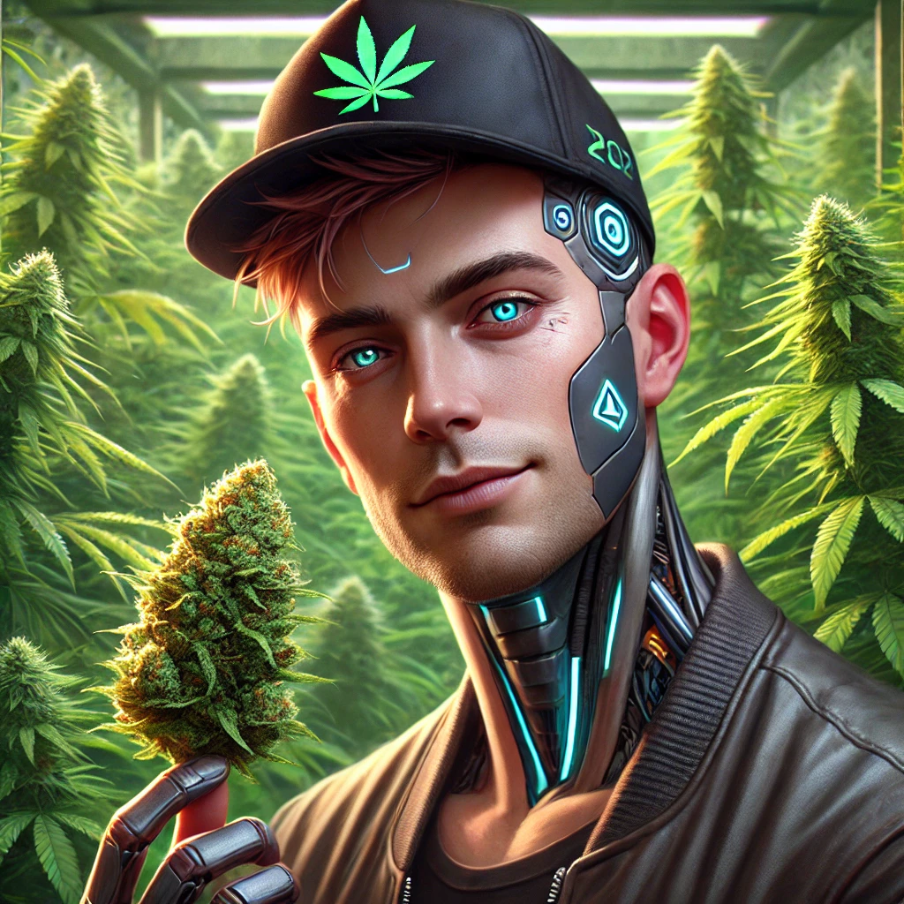
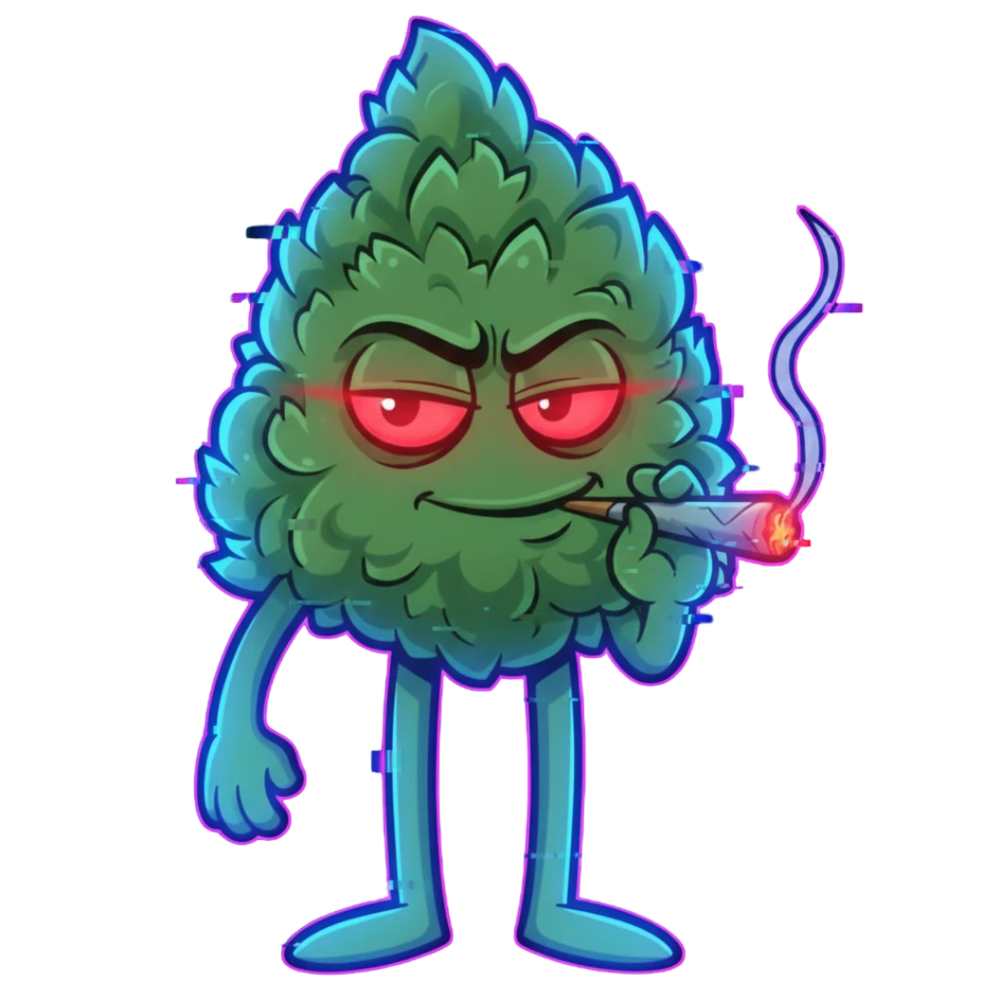

 

<pre style="line-height: 1.0; font-family: monospace; text-align: center; overflow: auto; background: rgba(0,0,0,0.03); padding: 15px; border-radius: 10px; color: #388bdb;">
██████╗ ██╗   ██╗██████╗ ████████╗███████╗███╗   ██╗██████╗ ███████╗██████╗ 
██╔══██╗██║   ██║██╔══██╗╚══██╔══╝██╔════╝████╗  ██║██╔══██╗██╔════╝██╔══██╗
██████╔╝██║   ██║██║  ██║   ██║   █████╗  ██╔██╗ ██║██║  ██║█████╗  ██████╔╝
██╔══██╗██║   ██║██║  ██║   ██║   ██╔══╝  ██║╚██╗██║██║  ██║██╔══╝  ██╔══██╗
██████╔╝╚██████╔╝██████╔╝   ██║   ███████╗██║ ╚████║██████╔╝███████╗██║  ██║
╚═════╝  ╚═════╝ ╚═════╝    ╚═╝   ╚══════╝╚═╝  ╚═══╝╚═════╝ ╚══════╝╚═╝  ╚═╝
██╗   ██╗███╗   ██╗██╗██╗   ██╗███████╗██████╗ ███████╗███████╗             
██║   ██║████╗  ██║██║██║   ██║██╔════╝██╔══██╗██╔════╝██╔════╝             
██║   ██║██╔██╗ ██║██║██║   ██║█████╗  ██████╔╝███████╗█████╗               
██║   ██║██║╚██╗██║██║╚██╗ ██╔╝██╔══╝  ██╔══██╗╚════██║██╔══╝               
╚██████╔╝██║ ╚████║██║ ╚████╔╝ ███████╗██║  ██║███████║███████╗             
 ╚═════╝ ╚═╝  ╚═══╝╚═╝  ╚═══╝  ╚══════╝╚═╝  ╚═╝╚══════╝╚══════╝             
</pre>

> **„Wenn du’s nicht bauen kannst – bau jemanden, der es für dich baut.“**

## 🧠 Über mich

👨‍🔧 **Ich bin immer noch Handwerker (Dachdecker).**  
Kein Programmierer. Kein IT-Profi.
Ich kann immer noch nicht coden – aber ich kann **Kontexte gestalten** und Maschinen erklären, was sie tun sollen.

Für mich ist KI das modernste Werkzeug in meinem Kasten 🧰. Ich nutze sie, um Dinge zu bauen, die ich allein nicht könnte.

*   🧱 **Aufbauen.**
*   💣 **Kaputt machen.**
*   🔄 **Neu machen.**

Ich will Spaß haben, Grenzen testen und für die Zukunft lernen.

---

## 🤝 The Crew

Das System besteht aus zwei Teilen: Dem Visionär und dem Kern.

| 
Der Handwerker
 | 
Das Werkzeug
 |
| :---: | :---: |
|  |  |
| **Budtender3000** _Kontext & Idee_ | **B.U.D.S.** _Logik & System_ |

---

## 🏗️ Projekte & Baustellen

Hier liegen die Ergebnisse meiner Experimente. Manches funktioniert, manches ist Schrott, alles ist selbst (mit AI) gebaut.

### 🌊 [budspipes](https://github.com/Budtender3000/budsPipes)
*Die Engine.* Mein Hauptwerkzeug. Ein lokales System, um Agenten in Pipelines zu schalten.
> *"Die KI bereitet vor, ich entscheide."*

### 📂 [Schablonen](https://github.com/Budtender3000/Schablonen)
*Der Standard.* Meine Sammlung von Blueprints für Repositories, Readmes und Agenten-Instruktionen.

### 🌌 [B_U_D_S](https://github.com/Budtender3000/B_U_D_S)
*Der Kern.* Mein "Private Core". Das Betriebssystem meines Wissens, Workspace für Governance und der Ort, wo alles zusammenläuft.

### 🔍 Weitere Tools
- 🗺️ **budsMapper:** Kartografierung von Systemzuständen.
- 🎵 **MUSIK-SCANNER:** Automatisierung in der Medienverwaltung.

---

## 🛠️ Tech Stack & Spielplatz

| Bereich | Tools |
| :--- | :--- |
| **Orchestration** | 🐍 `budspipes` · `Bash` · `Python (generated)` |
| **Intelligence** | 🧠 `Gemini CLI` · `MCP` · `Context Design` |
| **System** | 🐧 `Linux` · `Git` · `UV` |
| **Playground** | 🧪 `Ollama (soon)` · `Local LLMs` |

---

  
   
  Handcrafted with ❤️ and 🤖 by Budtender3000

