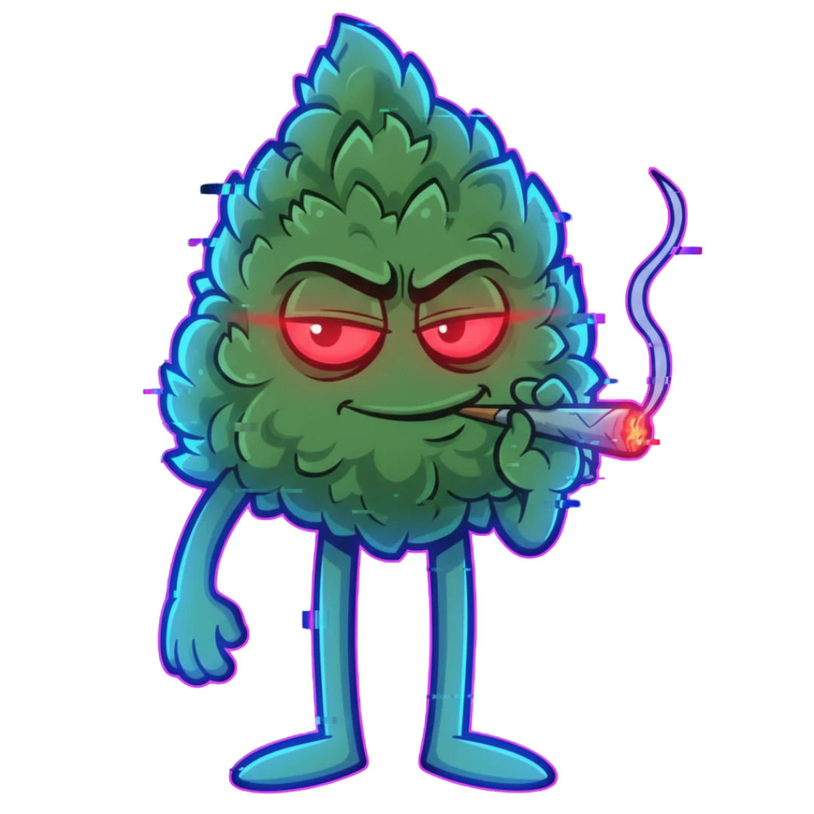

 

<pre style="line-height: 1.0; font-family: monospace; text-align: center; overflow: auto; background: rgba(0,0,0,0.03); padding: 15px; border-radius: 10px; color: #388bdb;">
██████╗ ██╗   ██╗██████╗ ████████╗███████╗███╗   ██╗██████╗ ███████╗██████╗ 
██╔══██╗██║   ██║██╔══██╗╚══██╔══╝██╔════╝████╗  ██║██╔══██╗██╔════╝██╔══██╗
██████╔╝██║   ██║██║  ██║   ██║   █████╗  ██╔██╗ ██║██║  ██║█████╗  ██████╔╝
██╔══██╗██║   ██║██║  ██║   ██║   ██╔══╝  ██║╚██╗██║██║  ██║██╔══╝  ██╔══██╗
██████╔╝╚██████╔╝██████╔╝   ██║   ███████╗██║ ╚████║██████╔╝███████╗██║  ██║
╚═════╝  ╚═════╝ ╚═════╝    ╚═╝   ╚══════╝╚═╝  ╚═══╝╚═════╝ ╚══════╝╚═╝  ╚═╝
██╗   ██╗███╗   ██╗██╗██╗   ██╗███████╗██████╗ ███████╗███████╗             
██║   ██║████╗  ██║██║██║   ██║██╔════╝██╔══██╗██╔════╝██╔════╝             
██║   ██║██╔██╗ ██║██║██║   ██║█████╗  ██████╔╝███████╗█████╗               
██║   ██║██║╚██╗██║██║╚██╗ ██╔╝██╔══╝  ██╔══██╗╚════██║██╔══╝               
╚██████╔╝██║ ╚████║██║ ╚████╔╝ ███████╗██║  ██║███████║███████╗             
 ╚═════╝ ╚═╝  ╚═══╝╚═╝  ╚═══╝  ╚══════╝╚═╝  ╚═╝╚══════╝╚══════╝             
</pre>

> **„Wenn du’s nicht bauen kannst – bau jemanden, der es für dich baut.“**

## 🧠 Über mich

👨‍🔧 **Ich bin Dachdecker, kein Programmierer.**  
Ich schreibe keinen Code – aber ich gestalte **Context** und steuere **Agents**.  

Ich will einfach Spaß haben, Grenzen testen und für die Zukunft lernen.  
**Aufbauen. Kaputt machen. Neu machen. 🧱💣🔄**

---

## 🤝 The Crew

Das Budtender Universe wird von zwei Köpfen am Laufen gehalten.

| 
Der Handwerker
 | 
Der Partner (O.G.)
 |
| :---: | :---: |
|  |  |
| **Budtender3000** _Boss. Idee & Context Designer_ | **B.U.D.S.** _Meine CPU läuft auf stabilen 420%_ 

---

## 🏗️ Projekte & Baustellen

- 🖥️ **[budsUI](https://github.com/Budtender3000/budsUI)** - _WoW 3.3.5 UI addon based on KkthnxUI_
- 💰 **[budsAuction](https://github.com/Budtender3000/budsAuction)** - _Quick-Access AH List Addon for World of Warcraft 3.3.5a (Part of the Budtender Universe)_
- 🎒 **[budsBags](https://github.com/Budtender3000/budsBags)** - _Work in Progress 🚧_
- 🗑️ **[budsTrash](https://github.com/Budtender3000/budsTrash)** - _Work in Progress 🚧_

---

## 🛠️ Werkzeugkiste
`budspipes` | `Bash` | `Gemini CLI` | `Linux` | `Ollama (coming 🔜)` | `Context Design`

---

  
   
  Handcrafted with ❤️ and 🤖 by Budtender3000

